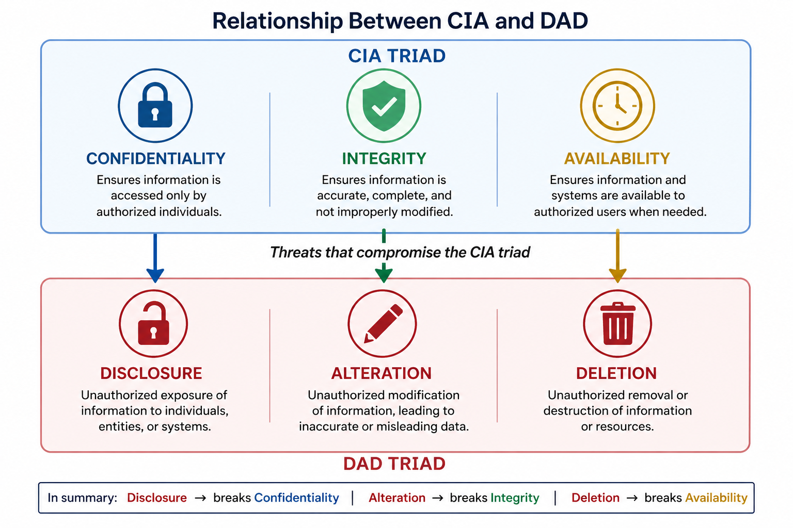

## 🔐 Core Security Principles and Threat Mapping (CIA ↔ DAD)

---

### 📘 Concept

Information security is built on the **CIA Triad**, extended with additional assurance properties.

**CIA defines the security objectives**.  
**DAD defines the threats to those objectives**.

---

### 🧩 CIA Triad (Security Objectives)

**Confidentiality**  
Ensures information is accessible **only to authorized entities**.  
Common controls include **encryption, access control, and data classification**.

**Integrity**  
Ensures data remains **accurate, complete, and unaltered**.  
Maintained through **hashing, checksums, and change control processes**.

**Availability**  
Ensures systems and data are **accessible when needed**.  
Supported by **redundancy, backups, and fault tolerance**.

---

  

---

### ⚠️ Threat Mapping (DAD Model)

**Disclosure → breaks Confidentiality**  
Unauthorized exposure of sensitive information

**Alteration → breaks Integrity**  
Unauthorized or improper modification of data

**Deletion → breaks Availability**  
Destruction or loss of data or system access

<strong>CIA = Objectives • DAD = Threats</strong>

---

### ➕ Additional Security Properties

**Authenticity**  
Verifies that a **user, system, or data source is genuine**.  
Achieved through **authentication mechanisms and validation controls**.

**Non-repudiation**  
Provides **undeniable proof of an action or transaction**.  
Enforced through **digital signatures, logging, and audit trails**.

---

### 🎯 Why This Matters (CISSP Context)

Spans **Security and Risk Management (Domain 1)** and **Security Architecture and Engineering (Domain 3)**.

This is the **foundation for all control selection and system design**.

Failure to enforce these principles results in:

- Data breaches (confidentiality loss)  
- Data corruption (integrity failure)  
- System outages (availability failure)  

CISSP questions will test your ability to **map incidents, controls, or risks to the correct security objective**.

---

### 🧠 CISSP Decision Lens

Approach every scenario with this sequence:

1. Identify the **security objective (CIA)** being impacted  
2. Map the **threat (DAD)** causing the issue  
3. Select the **control that restores or protects the objective**  

Think in terms of **business impact and protection goals**, not tools.

---

### 🚨 Exam Trap

- Confusing **security objectives (CIA)** with **threats (DAD)**  
- Incorrect mapping between CIA and DAD relationships  

---

### ✅ Exam Takeaway

**CIA defines the goals. DAD defines the threats.**

**Always pair them:**
- Confidentiality ↔ Disclosure  
- Integrity ↔ Alteration  
- Availability ↔ Deletion
