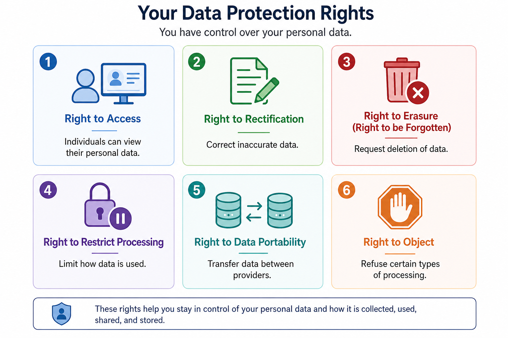

## 🔐 General Data Protection Regulation (GDPR)

---

### 📘 Concept

The **General Data Protection Regulation (GDPR)** is a comprehensive **data protection and privacy law** enacted by the European Union.

- Adopted in **2016**, enforced starting **2018**  
- Applies to **any organization processing personal data of EU residents**, regardless of location  

GDPR establishes strict requirements for **privacy, transparency, accountability, and data minimization**.

---

### 🧩 Key Roles

**Data Controller**  
Determines the **purpose and means** of processing personal data.  
👉 Owns **decision-making authority and accountability**

**Data Processor**  
Processes data **on behalf of the controller**.  
👉 Executes processing but does **not define purpose**

---

### ⚠️ Core Data Subject Rights

GDPR grants individuals (data subjects) control over their personal data:

  

---

### ⚠️ Critical Principle

GDPR enforces **user-centric data control** and organizational accountability.

<strong>User Rights → Organizational Responsibility → Legal Enforcement</strong>

---

### 🎯 Why This Matters (CISSP Context)

Falls under **Security and Risk Management (Domain 1)** and **Security Governance and Compliance (Domain 3)**.

Failure to comply can result in:

- Significant financial penalties  
- Legal liability  
- Loss of customer trust  
- Regulatory enforcement actions  

CISSP questions will test your ability to:

- Identify **controller vs processor responsibilities**  
- Recognize **data subject rights**  
- Apply **privacy-first decision-making**

---

### 🧠 CISSP Decision Lens

When evaluating a scenario:

- Who determines **purpose and control**? → Data Controller  
- Who **processes data on behalf of another**? → Data Processor  
- Are **data subject rights being respected**? → Must be enforced  

Default mindset:

**Protect user data and uphold individual rights**

---

### 🚨 Exam Trap

- Confusing **controller vs processor responsibilities**  
- Ignoring or violating **data subject rights**  
- Assuming GDPR only applies within the EU (it is **extraterritorial**)

---

### ✅ Exam Takeaway

**GDPR protects individuals, not organizations.**

- Controller = decides  
- Processor = executes  
- Users = have enforceable rights  

---

### 📚 Authoritative References

- EU General Data Protection Regulation (GDPR) – Regulation (EU) 2016/679  
- NIST Privacy Framework – Privacy Risk Management  
- NIST SP 800-53 – PL (Planning), AR (Accountability), and IA (Identification and Authentication) Controls  
- ISO/IEC 27701 – Privacy Information Management
