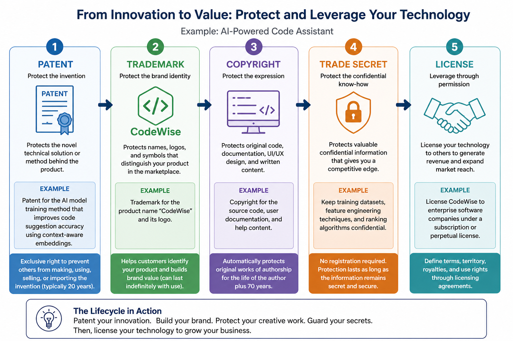

<h1 align="center">🧠 Intellectual Property (IP) & Licensing</h1>

<strong>Ownership • Protection • Legal Rights • Competitive Advantage</strong>

---

## 📘 Concept

**Intellectual Property (IP)** represents legally recognized ownership of **creations of the mind**.

It grants creators:

- **Exclusive rights** to use and control their work  
- The ability to **transfer, license, or inherit** those rights  

Organizations must protect IP using:

<strong>Due Care → Implement Protection  
Due Diligence → Monitor and Enforce</strong>

---

## 🧩 Types of Intellectual Property

### ⚙️ Patent
> Protects **inventions and processes**

- Grants **exclusive rights to use, produce, and sell**
- Time-limited protection  
- Requires **public disclosure**

---

### 🏷️ Trademark
> Protects **brand identity**

- Covers **names, logos, slogans**
- Distinguishes goods or services  
- Can be **renewed indefinitely**

---

### 🎨 Copyright
> Protects **original creative works**

- Includes:
  - Software code  
  - Books  
  - Music  
  - Media  
- Protection is **automatic upon creation**

---

### 🔒 Trade Secret
> Protects **confidential business information**

- No registration required  
- Must remain **secret to retain protection**  
- Examples:
  - Formulas  
  - Processes  
  - Proprietary methods  

---

  

---

## ⚖️ Licensing (Use Without Ownership)

**Licensing** grants permission to use IP **without transferring ownership**.

### Common Licensing Models

- **Perpetual License** – One-time purchase, indefinite use  
- **EULA (End User License Agreement)** – Defines legal usage terms  
- **Creative Commons (CC)** – Allows controlled sharing and reuse  

<strong>License = Permission, NOT Ownership</strong>

---

## 🚨 Additional Risk

**Corporate Espionage**  
Unauthorized acquisition of **proprietary or confidential information**.

- Often targets **trade secrets**  
- Can be internal or external  
- High impact on **competitive advantage**

---

## ⚠️ Critical Principle

IP protection depends on selecting the **correct legal mechanism** and enforcing it with **security controls**.

<strong>Asset Type → IP Protection → Security Controls</strong>

---

## 🎯 Why This Matters (CISSP Context)

Falls under **Security and Risk Management (Domain 1)** and represents:

- Legal risk  
- Regulatory risk  
- Competitive business risk  

Failure to protect IP leads to:

- Financial loss  
- Loss of competitive advantage  
- Legal liability  

CISSP questions will test your ability to:

- Identify the **correct IP category**  
- Apply the **appropriate protection method**  
- Recommend **controls to prevent unauthorized access or disclosure**

---

## 🧠 CISSP Decision Lens

When evaluating a scenario:

1. What type of **asset** is involved?  
2. Which **IP protection method** applies?  
3. Are **controls in place to protect it**?  
4. Are there **jurisdiction or enforcement limitations**?  

Default mindset:

**Identify → Protect → Enforce**

---

## 🚨 Exam Trap

Confusing:

- **Patent vs Trade Secret** (disclosed vs secret)  
- **Copyright vs Trademark** (creative work vs brand identity)

---

## ✅ Exam Takeaway

**Match the asset to the correct IP protection method.**

- Patent → Invention  
- Trademark → Brand  
- Copyright → Creative work  
- Trade Secret → Confidential advantage  

**Licensing grants use, not ownership.**

---

## 📚 Authoritative References

- U.S. Patent and Trademark Office (USPTO)  
- World Intellectual Property Organization (WIPO)  
- NIST SP 800-53 – MP (Media Protection), AC (Access Control), IA (Identification and Authentication)  
- ISO/IEC 27001 – Asset Management and Information Protection Controls
