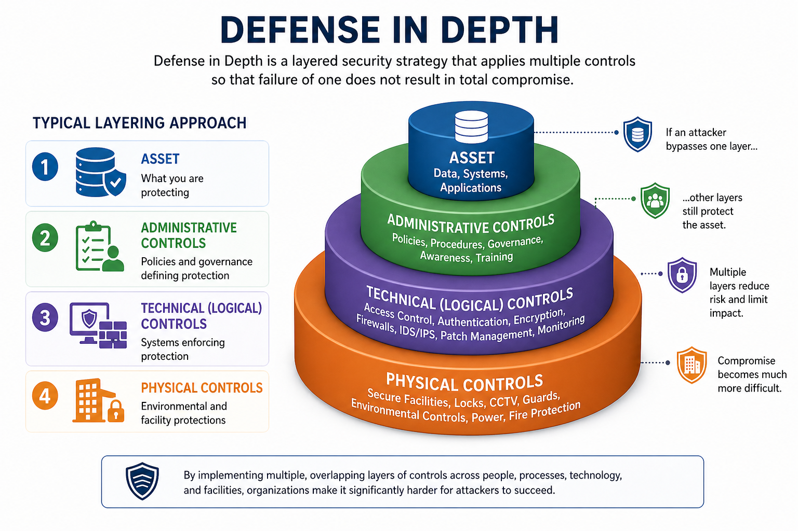

<h1 align="center">🛡️ Security Controls & Countermeasures</h1>

<strong>Safeguards • Layering • Control Selection • Risk Reduction</strong>

---

## 📘 Concept

**Security controls** are safeguards used to:

- Protect assets  
- Reduce risk  
- Enforce security objectives (CIA)  

They must be selected based on **business needs, risk tolerance, and measurable effectiveness**.

---

## 🧩 Control Categories (What Type of Control?)

### 📋 Administrative (Managerial)
> Governance and human-focused controls

- Policies, standards, procedures  
- Security awareness and training  
- Risk management and compliance  

---

### 💻 Technical (Logical)
> Technology-based enforcement

- Access control systems  
- Encryption  
- Firewalls, IDS/IPS  
- Authentication mechanisms  

---

### 🏢 Physical
> Environmental and facility protection

- Locks, guards, cameras  
- Fences, barriers  
- HVAC and fire suppression  

---

## ⚖️ Control Selection Criteria

Every control must be justified:

- **Cost** → Less than potential loss  
- **Benefit** → Addresses a real risk  
- **Effectiveness** → Provides measurable protection  

<strong>Cost ≤ Risk Reduction Value</strong>

---

## 🧱 Defense in Depth (Layered Security)

A **layered approach** ensures no single failure leads to compromise.

### 🔄 Layering Model

1. **Asset** – What you are protecting  
2. **Administrative Controls** – Define rules and intent  
3. **Technical Controls** – Enforce protection  
4. **Physical Controls** – Protect environment  

<strong>Multiple Layers → Reduced Single Point of Failure</strong>

  

---

## ⚙️ Functional Control Types (What Does It Do?)

### 🚨 Deterrent
> Discourage attacks

- Warning banners  
- Visible cameras  

---

### 🛑 Preventive
> Stop incidents before they occur

- Firewalls  
- Access control systems  

---

### 🔍 Detective
> Identify and alert on incidents

- IDS  
- Logging and monitoring  

---

### 🔧 Corrective
> Fix issues after detection

- Patching  
- System reconfiguration  

---

### 🔁 Compensating
> Alternative control when primary is not feasible

- Manual reviews  
- Additional oversight  

---

### 📢 Directive
> Guide or enforce behavior

- Policies  
- Standards  
- Procedures  

---

### ♻️ Recovery
> Restore operations after an incident

- Backups  
- Disaster recovery plans  

---

<strong>Prevent → Detect → Correct → Recover</strong>

---

## ⚠️ Critical Principle

Controls must be:

- **Layered (Defense in Depth)**  
- **Purpose-driven (functional alignment)**  
- **Cost-effective (risk-based selection)**  

---

## 🎯 Why This Matters (CISSP Context)

Spans:

- **Security and Risk Management (Domain 1)**  
- **Security Architecture and Engineering (Domain 3)**  

Poor control selection leads to:

- Ineffective protection  
- Wasted resources  
- Increased exposure  

CISSP questions will test your ability to:

- Identify **control categories vs functions**  
- Select the **most appropriate control for a scenario**  
- Apply **layered security thinking**

---

## 🧠 CISSP Decision Lens

When evaluating a scenario:

1. What **risk** is being addressed?  
2. What **type of control** is needed?  
3. What **function should it serve**?  
4. Is there **layering (defense in depth)**?  
5. Is the control **cost-justified**?  

Default mindset:

**Match control → to purpose → within a layered strategy**

---

## 🚨 Exam Trap

- Confusing:
  - **Preventive vs Detective**  
  - **Corrective vs Recovery**  
- Assuming **one control is sufficient**  
- Ignoring **cost vs benefit**

---

## ✅ Exam Takeaway

**Use layered controls.  
Match control type to function.  
Ensure cost is justified by risk reduction.**

---

## 📚 Authoritative References

- NIST SP 800-53 – Control Families (AC, SI, IR, CP, PE)  
- NIST SP 800-37 – Risk Management Framework  
- NIST SP 800-12 – Security Principles  
- ISO/IEC 27001 – Control Selection and Implementation
