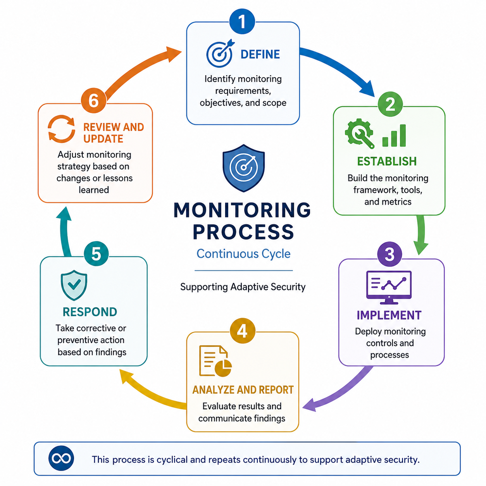

<h1 align="center">📡 Continuous Monitoring (Continuous Improvement)</h1>

<strong>Visibility • Validation • Metrics • Adaptive Security</strong>

---

## 📘 Concept

**Continuous Monitoring** is the process of maintaining **ongoing awareness of risk and security posture** by continuously evaluating:

- Controls  
- Systems  
- Threats  

It ensures security remains effective as environments and risks evolve.

<strong>Due Diligence in Action</strong>

---

## 📚 Key References

**NIST SP 800-137 (ISCM)**  
> Guidance for building and maintaining continuous monitoring programs  

**ISO/IEC 27004**  
> Defines **metrics and measurement** for security performance  

---

## 🧩 Monitoring Strategy Components

- **Scope** → What is being monitored  
- **Method** → How monitoring is performed  
- **Frequency** → How often (real-time, periodic, continuous)  
- **Metrics** → How effectiveness is measured  

<strong>Scope → Method → Frequency → Metrics</strong>

---

## 🔄 Monitoring Process (Continuous Cycle)

- **Define** → Identify objectives and scope  
- **Establish** → Build framework, tools, metrics  
- **Implement** → Deploy monitoring controls  
- **Analyze & Report** → Evaluate and communicate results  
- **Respond** → Take corrective/preventive action  
- **Review & Update** → Improve strategy  

  

<strong>Continuous Loop → Adaptive Security</strong>

---

## ⚠️ Critical Principle

Security is **not static**.

<strong>Monitor → Measure → Improve → Repeat</strong>

---

## 🎯 Why This Matters (CISSP Context)

Spans:

- **Security and Risk Management (Domain 1)**  
- **Security Operations (Domain 7)**  

Without continuous monitoring:

- Control effectiveness is unknown  
- Threats go undetected  
- Compliance cannot be validated  

CISSP questions will test your ability to:

- Emphasize **ongoing assessment over one-time checks**  
- Select **monitoring strategies and metrics**  
- Validate **control effectiveness**

---

## 🧠 CISSP Decision Lens

When evaluating a scenario:

1. Are controls being **continuously validated**?  
2. Are decisions based on **real metrics and data**?  
3. Is the process **adaptive and iterative**?  

Default mindset:

**Always prefer continuous awareness over periodic checks**

---

## 🚨 Exam Trap

- Treating security assessment as a **one-time activity**  
- Ignoring the need for **metrics and validation**  

---

## ✅ Exam Takeaway

**Continuous monitoring ensures controls remain effective.**

- It is **due diligence in action**  
- It must be **cyclical and metric-driven**  

---

## 📚 Authoritative References

- NIST SP 800-137 – Information Security Continuous Monitoring (ISCM)  
- NIST SP 800-53 – Continuous Monitoring Controls  
- NIST SP 800-37 – Risk Management Framework  
- ISO/IEC 27004 – Security Measurement and Metrics
